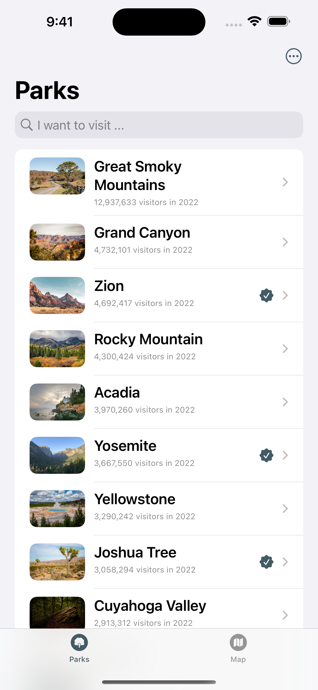
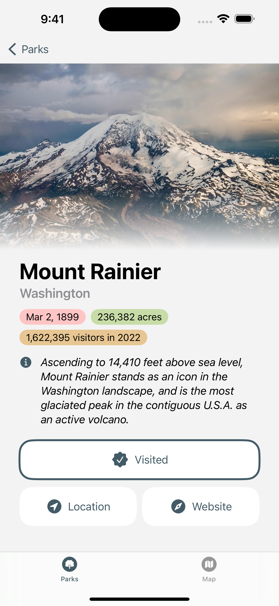
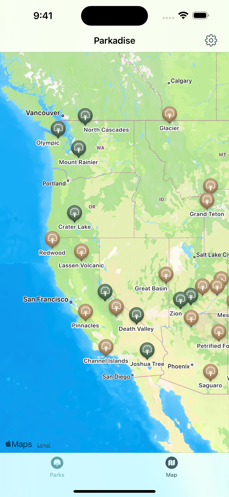
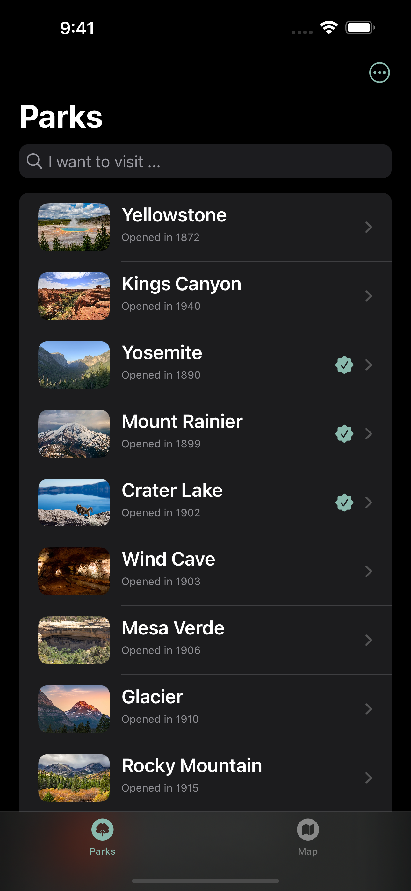
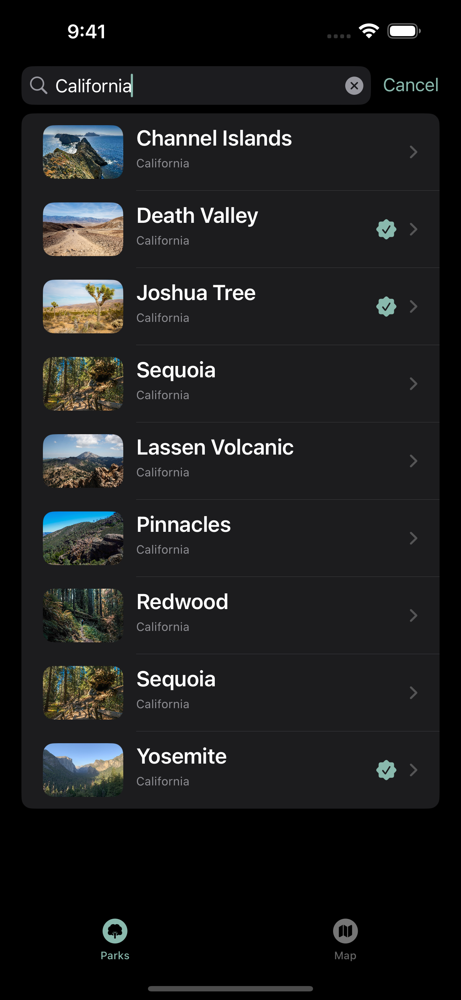

Parkadise is a digital "passport" to record your visits to US National Parks. Simply tap on screen to collect your National Park footprints and view them in  the map.

You may also check some statistics and brief descriptions of National Parks to get prepared for your next adventure.

Sharing with friends will be supported in future versions.

Download from App Store today. Feedbacks are highly appreciated!

